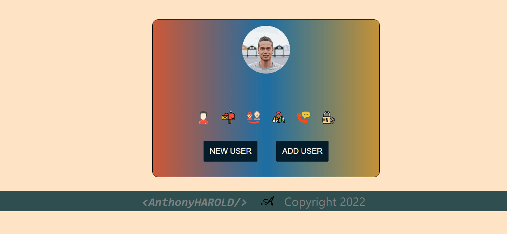

# Random User App v2    

## Description

Project aims to create a Random User App v2.

## Problem Statement

- We are adding a new project to our portfolios. So you and your colleagues have started to work on the project.

## Project Skeleton

```
Random User App v2     
|
|----readme.md         
SOLUTION
├── public
│     └── index.html
├── src
│    ├── assets
│    │       └── [images]
│    ├── components
│    │       ├── footer
│    │       |      ├── Footer.jsx
│    │       |      └── Footer.css
│    │       ├── RandomUser.js
│    ├── App.js
│    ├── App.css
│    ├── index.js
│    └── index.css
├── package.json
```

## Expected Outcome



## Objective

Build a Random User App using ReactJS.